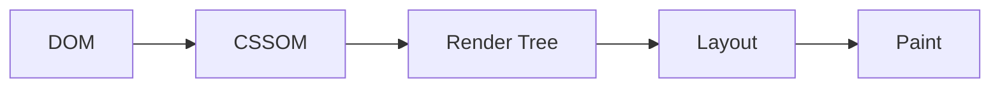
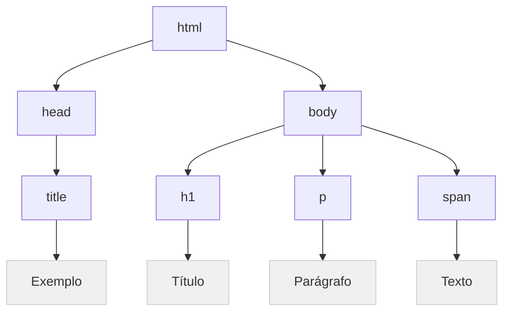
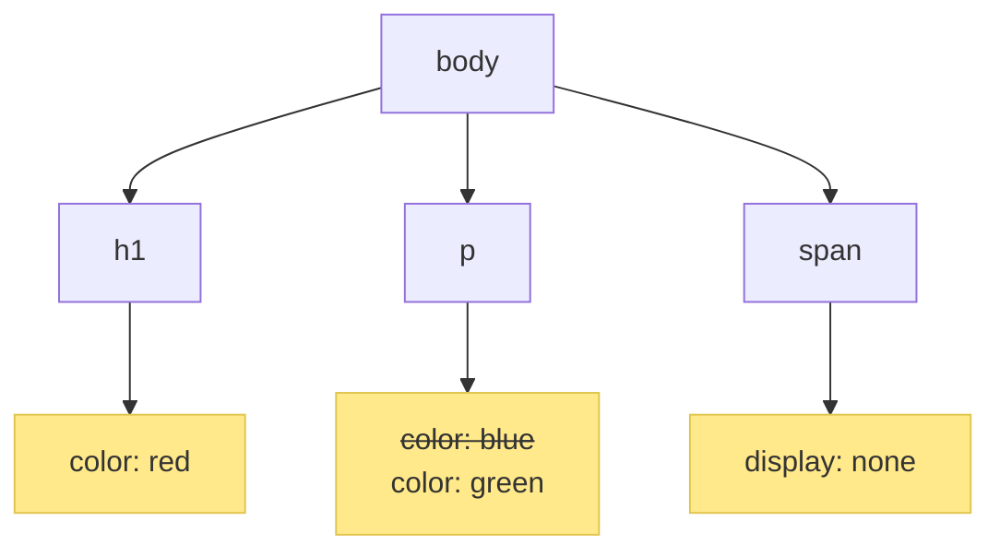
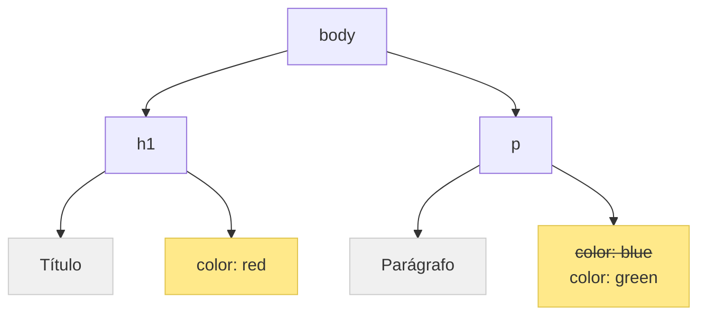

# O <span class="text-pink-500">Backstage</span> do CSS

Bora aprender como o CSS funciona por baixo dos panos?
<div class="justify-center">
  
</div>

---

<div class="flex justify-center">
  
  
  
  
  
</div>

<span class="text-pink-500">**Bianca Pereira**</span>
- <twemoji-laptop /> Sênior frontend developer **@Grupo Boticário**
- <twemoji-books /> Ciências da Computação, MBA em Engenharia de Software
- <twemoji-cat-face /> Mãe de gatos
- <twemoji-cherry-blossom /> Fã de cultura pop asiática
- <twemoji-hot-beverage /> **Líder de comunidade [@Cafeína Vagas](https://t.me/CafeinaVagas) no Telegram**

---

# "O CSS é fácil de <span class="text-pink-500">aprender</span>, mas difícil de <span class="text-pink-500">dominar</span>"


---

### Transformando código em pixels

- Entender como o browser funciona
- Cada navegador tem sua forma de renderizar o conteúdo na tela
- <span class="text-pink-500">Critical Rendering Path</span> **(CRP)**
- Performance <twemoji-rocket />

---

### <span class="text-pink-500">5 passos</span> do CRP



---

### Fase 1 - <span class="text-pink-500">DOM</span> (Document Object Model)

- Árvore criada a partir do HTML
- A árvore é composta de vários nós (nodes)
- Se organiza de forma hierárquica
- Quanto mais nós a árvore possuir, mas tempo o browser leva para construí-la

<h2><twemoji-backhand-index-pointing-right-medium-skin-tone /></h2>

---

### <span class="text-pink-500">Exemplo</span> - DOM

<div class="flex items-center">

<span class="m-5">
```html {all|1,11|2,4|3|6,10|7|8|9}
<html>
  <head>
    <title>Exemplo</title>
  </head>

  <body>
    <h1>Título</h1>
    <p>Parágrafo</p>
    <span>Texto</span>
  </body>
</html>
```
</span>

<span class="m-5">

</span>

</div>

---

### Fase 2 - <span class="text-pink-500">CSSOM</span> (CSS Object Model)

- Árvore criada a partir do CSS
- Estrutura similar a árvore DOM
- Essa árvore é criada de forma <span class="text-pink-500">muito rápida</span>
- Seletores com menos níveis são mais rápidos do que os com mais níveis

<h2><twemoji-backhand-index-pointing-right-medium-skin-tone /></h2>

---

### <span class="text-pink-500">Exemplo</span> - CSSOM

<div class="flex items-center">

<span class="m-5">
```css {all|1-3|5-7|9-11|13-15}
h1 {
  color: red;
}

p {
  color: blue;
}

body p {
  color: green;
}

span {
  display: none;
}
```
</span>

<span class="m-5">

</span>

</div>

---

### Fase 3 - <span class="text-pink-500">Render Tree</span>

- Nesta fase, o browser combina as duas árvores (DOM e CSSOM)
- O navegador checa cada nó e verifica se ele tem um estilo associado
- Nós **invisíveis** não estão presentes na render tree (`display: none`)

<h2><twemoji-backhand-index-pointing-right-medium-skin-tone /></h2>

---

### <span class="text-pink-500">Exemplo</span> - Render Tree (DOM + CSSOM)

<div class="flex items-center">

<span class="m-5">

</span>


</div>

---

### Fase 4 - <span class="text-pink-500">Layout</span>

- É o processo que determina o tamanho e o posicionamento de cada elemento da página
- Sempre que a render tree é modificada, o processo de layout é ativado
- **Reflow** é a mudança do layout após o primeiro carregamento
- Travamentos no scrolling e em animações

<h2><twemoji-backhand-index-pointing-right-medium-skin-tone /></h2>

---

### <span class="text-pink-500">Exemplo</span> - Layout e Reflow

- Um documento HTML possui uma tag ``
- Esse HTML é renderizado e o <span class="text-pink-500">**layout**</span> é calculado
- Essa imagem só vai ser baixada depois que o HTML for renderizado
- Você não determinou o `width` e o `height` da imagem
- Quando a imagem carregar, um processo de <span class="text-pink-500">**reflow**</span> ocorrerá

<div class="justify-center">
  
</div>

---

### Fase 5 - <span class="text-pink-500">Paint</span>

- É o responsável por <span class="text-pink-500">pintar os pixels</span> na tela
- Após o primeiro paint, as execuções seguintes são chamadas de **repaint**
- Esse processo acontece de forma bem rápida
- O tempo de repaiting é de acordo com a mudança que foi feita

---

<h1 class="flex">
  <span class="m-5">Obrigada!</span>
  
</h1>

<div class="flex items-center">
  <div>
    
  </div>

  <div>
    <strong class="uppercase text-3xl">
      <twemoji-sparkles /> <a href="https://biancapereira.github.io/bibi-garden/CSS%20backstage/Como%20o%20CSS%20funciona%3F/">Referências</a> <twemoji-sparkles />
    </strong>
    <ul class="text-3xl">
      <li>LinkedIn: <a href="https://www.linkedin.com/in/biancacpereira">biancacpereira</a></li>
      <li>Twitter: <a href="https://twitter.com/BiaSailorGeek">@BiaSailorGeek</a></li>
      <li>Instagram: <a href="https://www.instagram.com/biibis_">@biibis_</a></li>
      <li>Github: <a href="https://github/biancapereira">biancapereira</a></li>
    </ul>
  </div>
</div>

> **Comunidade para Iniciantes em TI [@CafeínaVagas](https://t.me/CafeinaVagas) <twemoji-hot-beverage /> no Telegram**
